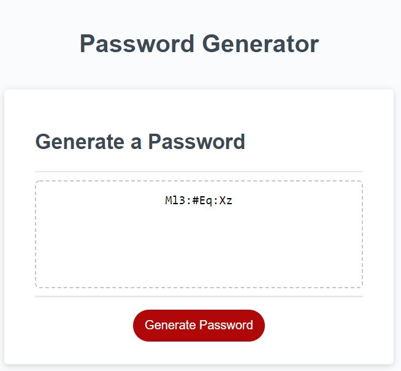

# Password Generator
This is a simple app used to generate a password for a user. Tech used was HTML and Javascript.

## User story:

AS AN employee with access to sensitive data
I WANT to randomly generate a password that meets certain criteria
SO THAT I can create a strong password that provides greater security

## Usage

- When the user clicks "Generate Password," prompts will appear asking what criteria the user would like. An event listener is added to the generate button 
- As long as the password is between 8 and 128, the function will run. Or else the user will have to resubmit.
- This user criteria is stored in an array which is then looped through the amount of times that the user wanted their password to be.
- This final array is then randomized and this is what appears when the user clicks generate password.

